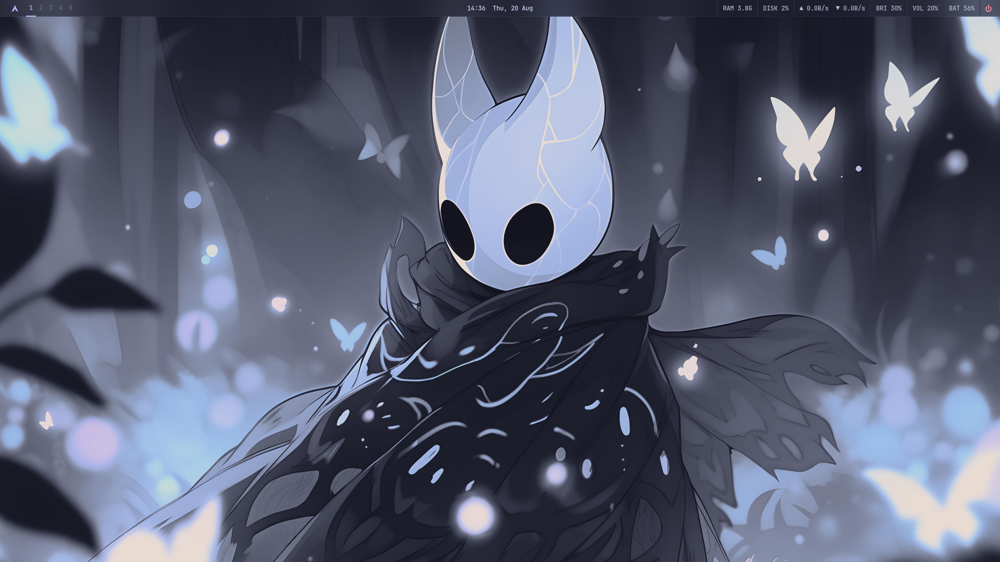
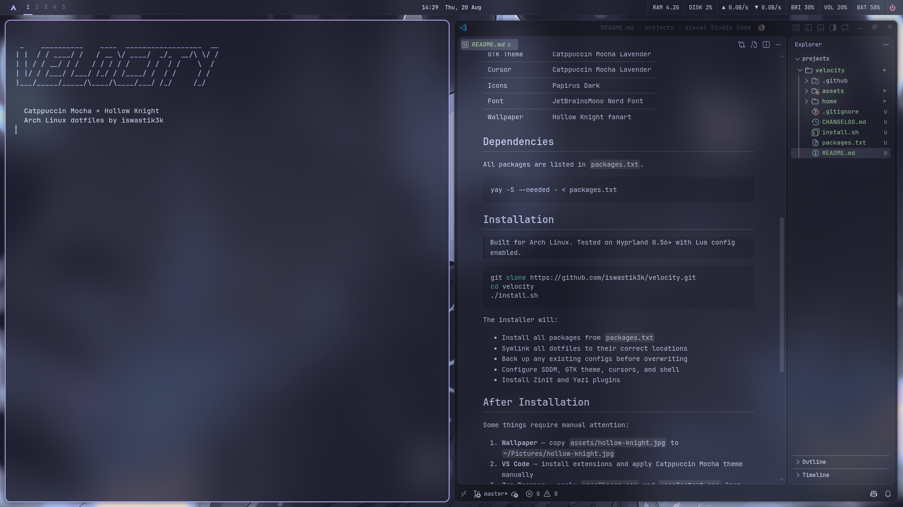

<div align="center">

# VELOCITY

_A coherent, minimal, keyboard-driven desktop environment_
_built on Arch Linux + Hyprland_


**Branch:** `variants/catppuccin-mocha`

</div>

---



<br>



## Philosophy

Void base. Lavender-blue accent. Frosted glass surfaces.
Catppuccin Mocha rendered through the aesthetic of Hollow Knight —
minimal chrome, maximum focus, keyboard-first workflow throughout.

## Stack

| Component      | Tool                       |
| --------------- | --------------------------- |
| Window Manager  | Hyprland (Lua config)      |
| Bar             | Waybar                     |
| Launcher        | Wofi                       |
| Terminal        | Kitty                      |
| Shell           | Zsh + Zinit                |
| Prompt          | Starship                   |
| Notifications   | Dunst                      |
| File Manager    | Yazi                       |
| Editor          | VS Code                    |
| Lock Screen     | Hyprlock                   |
| Idle Daemon     | Hypridle                   |
| Login Manager   | SDDM                       |
| System Info     | Fastfetch                  |
| GTK Theme       | Catppuccin Mocha Lavender  |
| Cursor          | Catppuccin Mocha Lavender  |
| Icons           | Papirus Dark                |
| Font            | JetBrainsMono Nerd Font     |
| Wallpaper       | Hollow Knight fanart         |

## Dependencies

All packages listed in `packages.txt`.

```bash
yay -S --needed - < packages.txt
```

## Installation

> Built for Arch Linux. Tested on Hyprland 0.56+ with Lua config enabled.

```bash
git clone https://github.com/iswastik3k/velocity.git
cd velocity
git checkout variants/catppuccin-mocha
./install.sh
```

The installer will:

- Install all packages from `packages.txt`
- Symlink all dotfiles to their correct locations
- Back up any existing configs before overwriting
- Configure SDDM, GTK theme, cursors, and shell
- Install Zinit and Yazi plugins

## After Installation

Some things require manual attention:

1. **Wallpaper** — copy `assets/hollow-knight.jpg` to `~/Pictures/hollow-knight.jpg`
2. **VS Code** — install extensions and apply Catppuccin Mocha theme manually
3. **Browser** — this build does not prescribe a browser theme; pick and configure your own

## Accent Role Discipline

| Role      | Swatch                                            | Hex       | Usage                            |
| --------- | -------------------------------------------------- | --------- | ---------------------------------- |
| Primary   |  | `#b4befe` | Active states, focus, borders     |
| Secondary |  | `#cba6f7` | Interaction, hover, selection      |
| Critical  |  | `#f38ba8` | Errors, powermenu                  |
| Warning   |  | `#f9e2af` | Warnings, capslock                 |

Applied consistently across every component — active states use
lavender, interactive/hover states use mauve, errors use red,
warnings use yellow. No exceptions.

## Versioning

Follows semantic versioning, independently per branch.

See [CHANGELOG.md](CHANGELOG.md) for this variant's release history.

## License

[MIT](LICENSE)

---

<div align="center">
<sub>built by iswastik3k · Arch Linux · 2026 · part of the <a href="https://github.com/iswastik3k/velocity">VELOCITY</a> project</sub>
</div>
