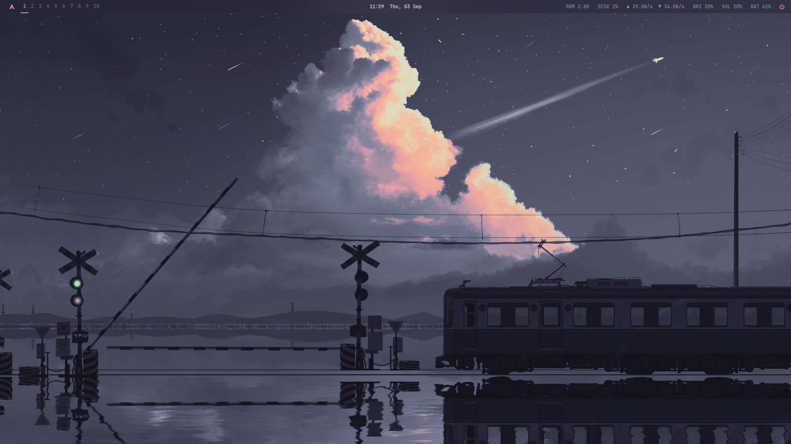
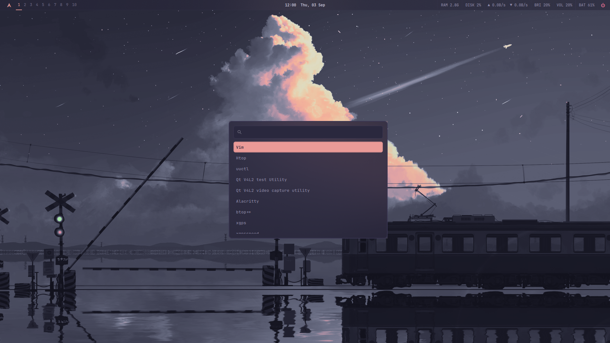
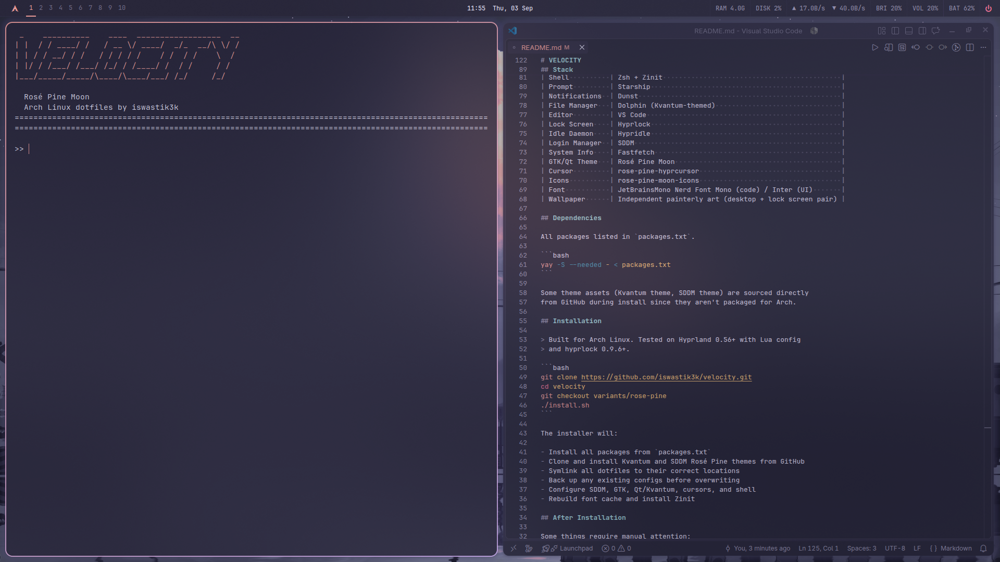
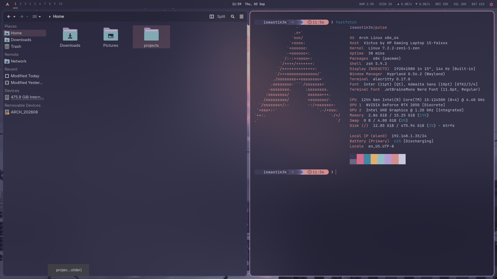

<div align="center">

# VELOCITY

_A coherent, minimal, keyboard-driven desktop environment_
_built on Arch Linux + Hyprland_


**Branch:** `variants/rose-pine`

</div>

---



<br>



<br>



<br>



## Philosophy

Dusty base. Rose-gold accent. Heavy frosted glass.
Rosé Pine Moon rendered through a softer, more elegant lens than
the Mocha build — macOS-inspired transparency, understated color
discipline, no visual noise. Every accent earns its place: rose
for primary focus, iris for interaction, gold for warning, love
for critical.

## Stack

| Component      | Tool                                                   |
| -------------- | ------------------------------------------------------ |
| Window Manager | Hyprland (Lua config)                                  |
| Bar            | Waybar                                                 |
| Launcher       | Wofi                                                   |
| Terminal       | Alacritty                                              |
| Shell          | Zsh + Zinit                                            |
| Prompt         | Starship                                               |
| Notifications  | Dunst                                                  |
| File Manager   | Dolphin (Kvantum-themed)                               |
| Editor         | VS Code                                                |
| Lock Screen    | Hyprlock                                               |
| Idle Daemon    | Hypridle                                               |
| Login Manager  | SDDM                                                   |
| System Info    | Fastfetch                                              |
| GTK/Qt Theme   | Rosé Pine Moon                                         |
| Cursor         | rose-pine-hyprcursor                                   |
| Icons          | rose-pine-moon-icons                                   |
| Font           | JetBrainsMono Nerd Font Mono (code) / Inter (UI)       |
| Wallpaper      | Independent painterly art (desktop + lock screen pair) |

## Dependencies

All packages listed in `packages.txt`.

```bash
yay -S --needed - < packages.txt
```

Some theme assets (Kvantum theme, SDDM theme) are sourced directly
from GitHub during install since they aren't packaged for Arch.

## Installation

> Built for Arch Linux. Tested on Hyprland 0.56+ with Lua config
> and hyprlock 0.9.6+.

```bash
git clone https://github.com/iswastik3k/velocity.git
cd velocity
git checkout variants/rose-pine
./install.sh
```

The installer will:

- Install all packages from `packages.txt`
- Clone and install Kvantum and SDDM Rosé Pine themes from GitHub
- Symlink all dotfiles to their correct locations
- Back up any existing configs before overwriting
- Configure SDDM, GTK, Qt/Kvantum, cursors, and shell
- Rebuild font cache and install Zinit

## After Installation

Some things require manual attention:

1. **Wallpapers** — copy `assets/rose-pine-desktop.jpg` and
   `assets/rose-pine-lock.jpg` to `~/Pictures/` if the installer
   didn't
2. **hyprpaper** — confirm it points to `rose-pine-desktop.jpg`
3. **VS Code** — install the theme extension:

```bash
   code --install-extension mvllow.rose-pine
```

4. **Kvantum** — if the theme didn't auto-apply, run
   `kvantummanager` and select `rose-pine-moon-rose`
5. **Browser** — this variant deliberately ships no browser
   theming; pick and configure your own

## Font Architecture

A dedicated fontconfig governs font resolution system-wide:

| Role       | Font                             |
| ---------- | -------------------------------- |
| Monospace  | JetBrainsMono Nerd Font Mono     |
| Sans-serif | Inter                            |
| Serif      | Noto Serif                       |
| Emoji      | Noto Color Emoji (weak fallback) |

Alacritty does not support ligatures — this is a known,
permanent limitation of the terminal, not a config issue.

## Accent Role Discipline

| Role      | Swatch                                            | Hex       | Usage                         |
| --------- | ------------------------------------------------- | --------- | ----------------------------- |
| Primary   |  | `#ea9a97` | Active states, focus, borders |
| Secondary |  | `#c4a7e7` | Interaction, hover, selection |
| Critical  |  | `#eb6f92` | Errors, powermenu             |
| Warning   |  | `#f6c177` | Brightness, volume, capslock  |

Applied consistently across every component — active states use
rose, interactive/hover states use iris, errors use love, warnings
use gold. No exceptions.

## Versioning

Follows semantic versioning, independently per branch.

See [CHANGELOG.md](CHANGELOG.md) for this variant's release history.

## License

[MIT.](LICENSE)

---

<div align="center">
<sub>built by iswastik3k · co-built by claude · Arch Linux · 2026</sub>
<br>
<sub>- part of the <a href="https://github.com/iswastik3k/velocity">VELOCITY</a> project -</sub>
</div>
